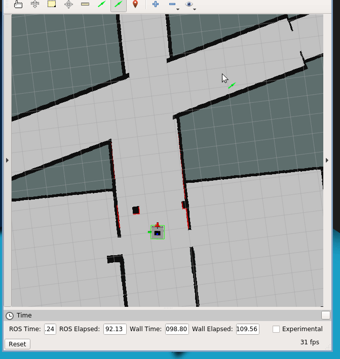
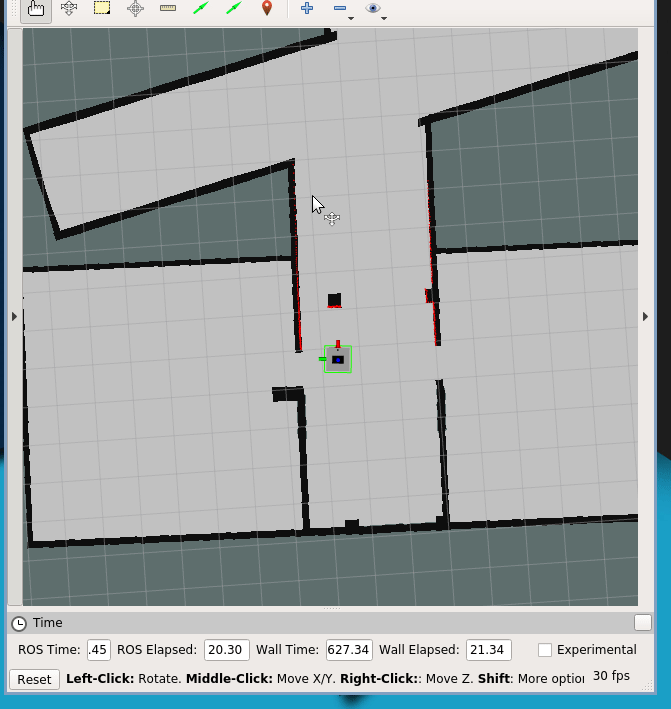
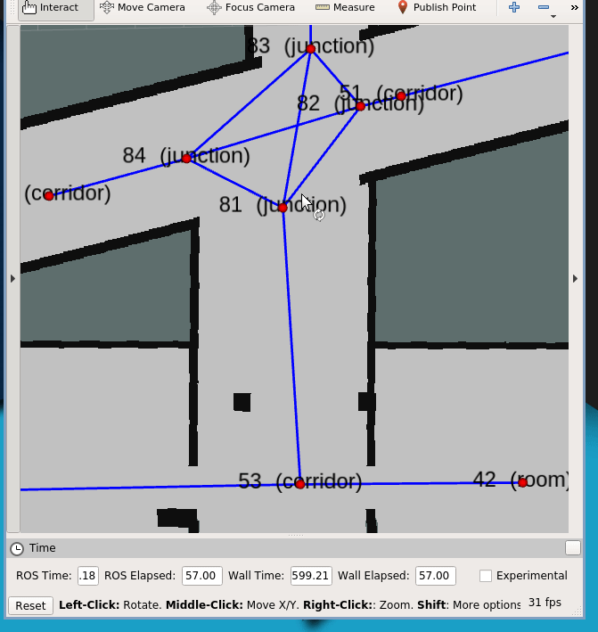

# Basic Navigation

### Note
For simulation, [ropod\_sim](https://github.com/DharminB/ropod_sim) is a requirement.

## basic\_navigation

The robot moves in a straight line from its current position to given goal position. The robot
rotates in place to align to the straight line, follows the line to reach the
goal position and finally rotates in place to reach goal orientation.
In short, it uses rotate-drive-rotate strategy.
If there is an obstacle in its path, the robot stops before colliding and
returns failure.

It accepts goal in 2 ways
1. Pose goal (`/move_base_simple/basic_goal`) where it behaves as mentioned above.
2. Path goal (`/basic_navigation/goal_path`) where it follows the given path
   with pre-defined safety params

## topological\_navigation

Once a goal is requested this navigation does the following
1. Uses `topological_planner` to plan a global path from robot's current position to requested goal position.
2. Uses `geometric_planner` to plan a geometric path from robot's current
   position to next topological node
3. Sends the geometric plan to `basic_navigation`.
4. Call `recovery_manager` if a failure occurs.
5. Repeat step 2 and 3 until the robot reaches the goal position.

## topology\_visualiser

A node to visualise and edit topological graph.
